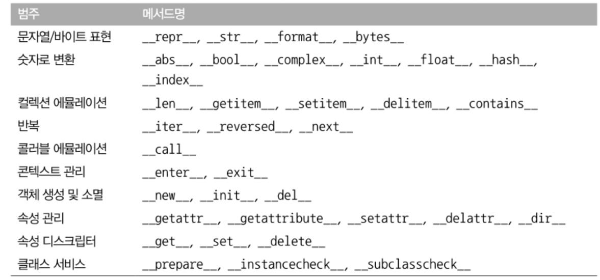
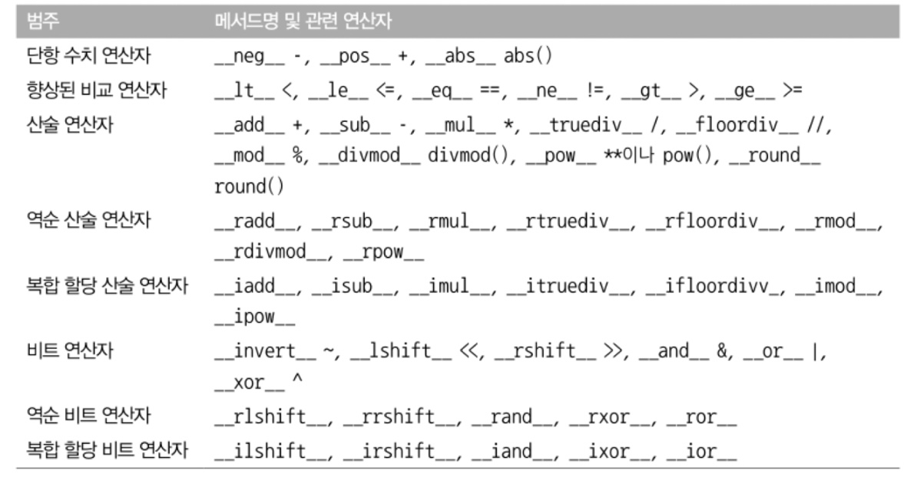

## chapter1.Python Data Model

### contents
___

- [1. 파이썬 데이터 모델과 특별 메서드](#1-파이썬-데이터-모델과-특별-메서드)

- [2. 특별 메서드는 어떻게 사용되나?](#2-특별-메서드는-어떻게-사용되나)

- [3. 특별 메서드 개요](#3-특별-메서드-개요)

- [4. 읽을거리](#4-읽을거리)

<br></br>

### 1. 파이썬 데이터 모델
___
  -
  -
  -


<br></br>

### 2. 특별 메서드는 어떻게 사용되나
___
  - 2-1.Collection emulation(\_\_len\_\_ / \_\_getitem\_\_)
    
    - Card Deck 예제코드
    ```python
    Card = collections.namedtuple('Card', ['rank', 'suit'])
    class FrenchDeck:
        def __init__(self):
            ranks = [str(n) for n in range(2, 11)] + list('JQKA')
            suits = 'spades diamonds clubs hearts'.split()
            self._cards = [Card(rank, suit) for suit in self.suits
                                            for rank in self.ranks]
    ```
    collection.namedtuple 로 이름이 있는 튜플(시퀀스) 객체 생성  
    ```python
    # __len__() 정의 시 len() 함수 사용 가능
    def __len__(self):
        return len(self._cards)
    
    deck = FrenchDeck()
    print(deck.__len__())
    #1 52
    print(len(deck))
    #2 52

    ```
    특별 메서드 \_\_len\_\_() 정의 
    ```python
    def __getitem__(self, position):
        return self._cards[position] 
    ```
    특별 메서드 \_\_getitem\_\_() 정의
    ```python
    for card in deck[12:26:13]:
        print(card)
    '''
    Card(rank='A', suit='spades')
    Card(rank='A', suit='diamonds')
    '''
    from random import choice
    choice(deck)
    '''
    Card(rank='8', suit='spades')
    '''
    ```
    \_\_len\_\_() , \_\_getitem\_\_() 으로 다양한 기능(반복/슬라이싱/표준 라이브러리 등) 활용 가능 <br>
    ref> 컬렉션에 \_\_contains\_\_() 메서드가 없으면 in 연산자는 차례대로 검색함

  - 2-2.문자열 표현
    - ㅁㄴㅇㅁㄴㅇ

  - 2-3.산술 연산자
    - ㅁㄴㅇㅁㄴㅇ

  > 특별 메서드를 구현하면 사용자 정의 객체도 내장형 객체처럼 작동하여, **파이썬스러운** 표현력의 코딩 스타일 구사 가능 <br>
  > FrenchDeck이 암묵적으로 object를 상속 받지만, 상속 대신 <u>데이터 모델</u>과 <u>구성</u>을 이용하여 기능을 가져옴 <br>
  > \_\_len\_\_() 과 \_\_getitem\_\_() 특별 메서드를 구현함으로써, 표준 파이썬 <u>시퀀스</u>처럼 작동하여, 반복/슬라이싱/표준 라이브러리 사용 가능 <br>
  > **</u>구성</u>** 덕분에,  \_\_len\_\_() 과 \_\_getitem\_\_() 는 모든 작업을 list 객체인 self._cards 로 넘길 수 있음.

<br></br>

### 3-특별-메서드-개요
___
  - 3-1. 특별 메서드 개요1(연산자 제외) 
   

  - 3-2. 특별 메서드 개요2(연산자)
   
  
  > **ref. Fluent-Python (Luciano Ramalho)** 

<br></br>

### 4-읽을거리
___
  - [Data-Model of The-Python-Language-Reference](http://docs.python.org/3/reference/datamodel.html)
    - 파이썬 공식 홈페이지
  - **Python In A Nutshell. 2E** (Alex Martelli)
    - 데이터 모델을 자세히 설명한 저서. 
    - 파이썬 ver2.5를 집중적으로 다룸 (그 후 버전에서 큰 변화 없었음)
  - **Python Essential Reference. 4E** & **Python Cookbook. 3E** (David Beazley) 
    - 파이썬 ver3의 데이터 모델을 자세히 설명한 저서

